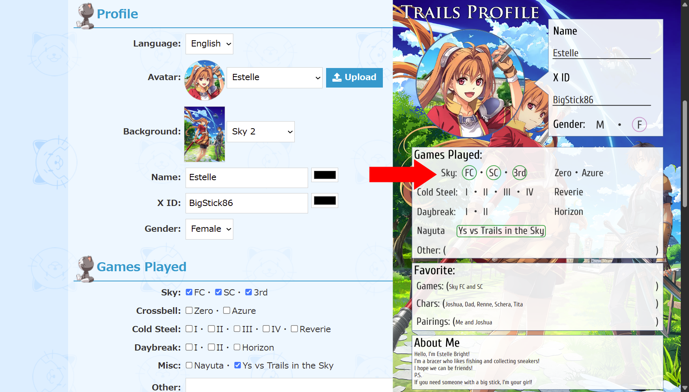

# Kiseki Profile Generator
Kiseki Profile Generator is a website that lets you create your own Trails series profile which you can share with others on X via the [#TrailsProfile](https://x.com/search?q=%23TrailsProfile&src=typed_query&f=live) or [#軌跡プロフィール](https://x.com/search?q=%23%E8%BB%8C%E8%B7%A1%E3%83%97%E3%83%AD%E3%83%95%E3%82%A3%E3%83%BC%E3%83%AB&src=typed_query&f=live) hashtags. It's a way to meet other fans of the series by sharing what games you've played, your favorite characters, etc. You can give it a try online via the following link!

**https://sethclydesdale.github.io/kiseki-profile-generator/**

### Demo

## Profile Templates 
This website was created to help make the process of filling out the image template easier, since not everyone has access to image editing software. However, if you'd like to add your own personal flair, feel free to download the templates via the following link.

[**Download Template Package**](https://sethclydesdale.github.io/kiseki-profile-generator/aeon-system/template/Kiseki%20Profile%20Templates.zip)

This package contains both English and Japanese templates. You can edit the provided images in Photoshop, [GIMP](https://www.gimp.org/), [Pixlr](https://pixlr.com/), or any other image editing software.

## Special Thanks
- [**html2canvas**](https://github.com/niklasvh/html2canvas) for generating the Kiseki Profile images.
- [**Font Awesome**](https://fontawesome.com/) for the awesome icons.
- [**haya63pasca**](https://twitter.com/haya63pasca/status/1454263058683944967) for the original templates and idea.
- [**ScottyT**](https://github.com/ScottyT) for testing and providing feedback.
- [**Tio Plato**](https://sethclydesdale.github.io/tio-plato-is-the-best/) for programming assistance.
- [**Nihon Falcom**](https://www.falcom.co.jp/) for the Illustrations, Music, Trails series, and of course, Tio Plato.

  

